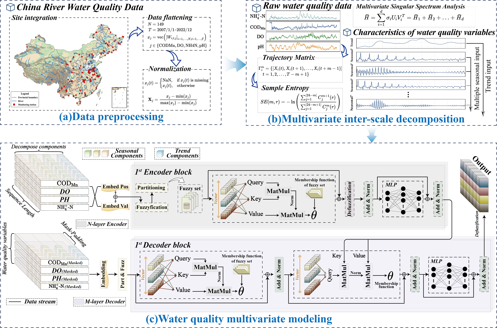

# Multiscale Decomposition and Fuzzy-Rule Attention for Water Quality Forecasting


This repository provides a lightweight, runnable demo for the paper:

**Multiscale decomposition and fuzzy-rule attention: A transferable cross-basin framework for long-term water quality forecasting**  
Jingzhe Hu, Ying Li, Dawei Jiang, Danrong Zhang, Chunhui Lu, and Wei Zhi  
*Water Research*, 295, 125593, 2026. DOI: [10.1016/j.watres.2026.125593](https://doi.org/10.1016/j.watres.2026.125593)

The demo trains and tests the `Proposed` model on a compact public water-quality CSV. It is intended as a clean code-release example rather than a full reproduction of every experiment, baseline, figure, and cross-basin setting in the paper.

## Method Overview

The paper addresses long-term river water quality forecasting under sparse, non-stationary, and heterogeneous monitoring conditions. The full study used in-situ observations from 149 monitoring stations across Chinese river basins from 2007 to 2022.

<p align="center">
  
  <br><br>
  <b>Figure 1.</b> Overview of data preprocessing, multivariate inter-scale decomposition, and fuzzy-rule attention modeling.
</p>

The proposed framework combines:

- **Multiscale signal decomposition** with MSTE-weighted MSSA to separate trend, seasonal, and residual components.
- **Fuzzy-rule attention** inside a Transformer-style encoder to handle uncertainty and regime-dependent water quality dynamics.
- **Differentiable defuzzification** to convert fuzzy rule activations into continuous forecasts.
- **Residual forecasting anchors** to stabilize short-horizon extrapolation around recent observations.

In the paper, the framework achieved an overall average NSE of `0.75 +/- 0.19` for 26-step-ahead forecasts and improved average NSE by `24.9%` over state-of-the-art baselines. The cross-region modeling strategy also improved NSE by `28.4%` compared with independent single-station models.

## Repository Structure

| Path | Description |
| --- | --- |
| `run_demo.py` | Main entry point for training and testing the demo model. |
| `run_extrapolate.py` | Uses a trained checkpoint to extrapolate future water-quality values. |
| `models/Proposed.py` | Fuzzy logic-enhanced Transformer forecasting model. |
| `models/multiscale_decomposition.py` | Standalone MSTE-weighted MSSA decomposition implementation. |
| `layers/` | Embedding, encoder/decoder, and attention modules. |
| `data_provider/` | Dataset normalization and DataLoader construction. |
| `utils/` | Metrics, training tools, time features, DTW, and augmentation helpers. |
| `dataset/Public-dataset/CN_WQ_selected_sites.csv` | Raw selected-site demo data with station metadata. |
| `dataset/Public-dataset/CN_WQ_selected_sites_model.csv` | Model-ready demo data with `date`, `pH`, `DO`, `NH3N`, and `CODMn`. |
| `Record/` | Example checkpoints, metrics, predictions, and generated plots. |

## Requirements

Recommended environment:

- Python 3.10 or newer
- PyTorch matching your CPU/CUDA environment
- NumPy, pandas, SciPy, scikit-learn, matplotlib, seaborn, and tqdm

Install Python dependencies:

```bash
pip install -r requirements.txt
```

If PyTorch is not installed by the command above in your environment, install the correct CPU or CUDA build from the official PyTorch instructions, then rerun the command.

## Data

The demo uses four water-quality indicators:

- `pH`
- `DO`
- `NH3N`
- `CODMn`

Two CSV files are included:

- `CN_WQ_selected_sites.csv`: raw selected-site data with `id`, `time`, `Lon`, `Lat`, and the four indicators.
- `CN_WQ_selected_sites_model.csv`: simplified model-ready data with `date` and the four indicators.

`run_demo.py` defaults to `CN_WQ_selected_sites.csv` and normalizes it internally into the required feature order. The dataset is split by time into 40% training, 20% validation, and 40% testing.

## Quick Start

Run the demo on CPU:

```bash
python run_demo.py --device cpu
```

Run with CUDA if a compatible PyTorch build is installed:

```bash
python run_demo.py --device cuda
```

Let the script automatically choose CUDA when available:

```bash
python run_demo.py
```

For a short smoke test:

```bash
python run_demo.py --epochs 3 --device cpu
```

## Usage Examples

Forecast a different water-quality indicator:

```bash
python run_demo.py --target pH --epochs 3 --device cpu
python run_demo.py --target NH3N --epochs 3 --device cpu
python run_demo.py --target CODMn --epochs 3 --device cpu
```

Change the forecasting window:

```bash
python run_demo.py --target DO --seq-len 10 --label-len 5 --pred-len 3
```

Show all available arguments:

```bash
python run_demo.py --help
```

## Common Options

Most users only need to adjust the target variable, training epochs, device, and forecasting window:

- `--target`: choose one of `pH`, `DO`, `NH3N`, or `CODMn`.
- `--epochs`: set the number of training epochs.
- `--device`: choose `auto`, `cpu`, or `cuda`.
- `--seq-len`, `--label-len`, `--pred-len`: control the input and forecast lengths.

For all advanced model and training options, run:

```bash
python run_demo.py --help
```

## Output Files

After a successful run, outputs are saved under `Record/`.

For the default setting, the directory name is:

```text
forecast_Proposed_DO_sl10_ll5_pl3
```

Main outputs:

| File | Description |
| --- | --- |
| `Record/Model_Save/<setting>/checkpoint.pth` | Best model checkpoint selected by validation loss. |
| `Record/results/<setting>/metrics.npy` | Metrics array: MSE, MAE, RMSE, MAPE, MSPE, R2/NSE, SMAPE, KGE, SDE, and Theil's U. |
| `Record/results/<setting>/pred.npy` | Test predictions. |
| `Record/results/<setting>/true.npy` | Test ground truth. |
| `Record/results/<setting>/All_date.pdf` | Full prediction-vs-observation plot. |
| `Record/results/<setting>/200-800.pdf` | Zoomed plot for samples 200 to 800 when enough samples exist. |
| `Record/test_results/<setting>/*.pdf` | Optional per-batch plots when `--visual-interval` is enabled. |
| `Record/result_forecast.txt` | Text log of metric values. |

## Future Extrapolation

After training, `run_extrapolate.py` can load a checkpoint and forecast future values from the latest available history window.

Example:

```bash
python run_extrapolate.py --target DO --device cpu
```

The script saves:

- `Record/extrapolation/<setting>/extrapolation.csv`
- `Record/extrapolation/<setting>/extrapolation.npy`
- `Record/extrapolation/<setting>/extrapolation.pdf`

Use the same key settings as the checkpoint you load, especially the target variable and forecast-window lengths.

## Notes on Reproducibility

- The demo fixes the random seed through `--seed` and defaults to `2026`.
- CPU and GPU runs can still differ slightly because of backend-level numerical behavior.
- The included selected-site dataset is for code demonstration. It does not replace the full cross-basin evaluation dataset used in the paper.
- `models/multiscale_decomposition.py` is provided as a standalone implementation of the multiscale decomposition component. The compact demo focuses on training and testing the fuzzy-rule attention forecasting model on the bundled CSV.

## Citation

If this repository or paper is useful for your research, please cite:

```bibtex
@article{hu2026multiscale,
  title = {Multiscale decomposition and fuzzy-rule attention: A transferable cross-basin framework for long-term water quality forecasting},
  author = {Hu, Jingzhe and Li, Ying and Jiang, Dawei and Zhang, Danrong and Lu, Chunhui and Zhi, Wei},
  journal = {Water Research},
  volume = {295},
  pages = {125593},
  year = {2026},
  doi = {10.1016/j.watres.2026.125593}
}
```

## Contact

For questions about the demo code, please open an issue or contact the paper authors through the correspondence information in the published article.
